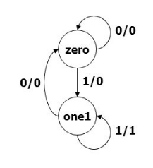

# Reduce 1's Finite State Machine
- Changes the first 1 to 0 in each string of 1's
1. Design a Moore Finite State Machine based on the state diagram given below:

2. Write a testbench to verify the same.
3. Upload the code to this folder

#### OR
1. Design a Mealy Finite State Machine based on the state diagram given below:

2. Write a testbench to verify the same.
3. Upload the code to this folder.
