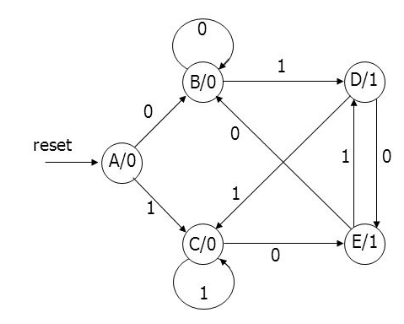
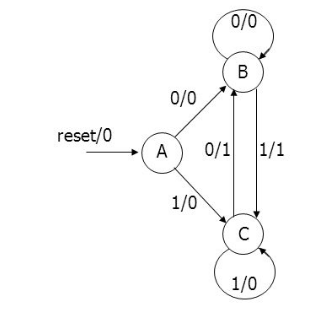

# `01` or `10` Finite State Machine
1. Design a Moore Finite State Machine based on the state diagram given below:

2. Write a testbench to verify the same.
3. Upload the code in this folder.

#### OR
1. Design a Mealy Finite State Machine based on the state diagram given below:

2. Write a testbench to verify the same.
3. Upload the code in this folder.
